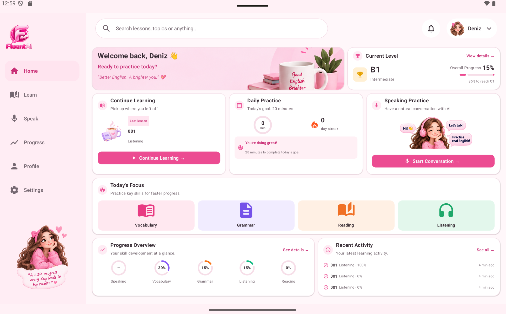

# FluentAI

FluentAI is a personal hobby project developed specifically for a friend. It is an Android-native tablet application designed for English practice, with Grammar, Vocabulary, Reading, and Listening modules structured around CEFR levels and IELTS-style learning and practice.

## Overview

FluentAI is designed primarily for Android tablets and supports English learning from CEFR A2 through C2. It brings together Vocabulary, Grammar, Reading, Listening, and AI-assisted Speaking practice in an IELTS-informed learning experience.

## Tech Stack

- Kotlin and Jetpack Compose
- Room and DataStore
- Hilt
- Media3
- OkHttp WebSocket integration for Gemini Live-compatible speaking practice
- Kotlin Coroutines and kotlinx.serialization

## Development Note

Runtime AI features that use Gemini require credentials to be configured locally. Local environment files and secrets are intentionally excluded from version control; `.env.example` documents the required variable without containing a real credential.
